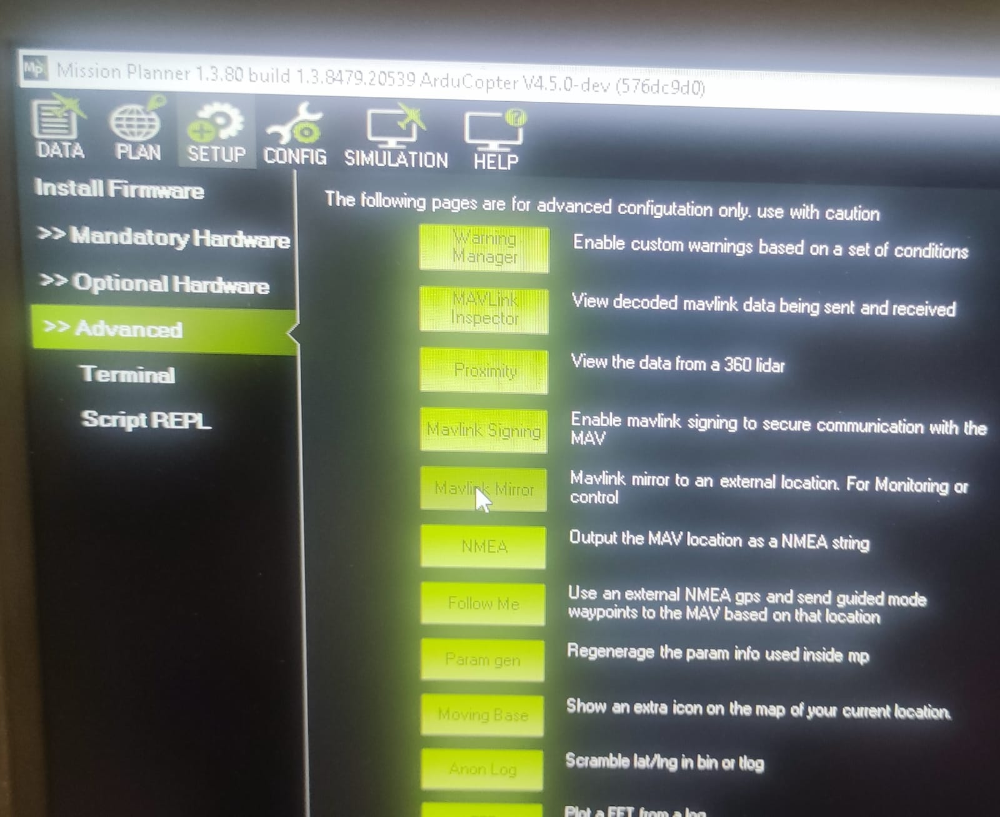
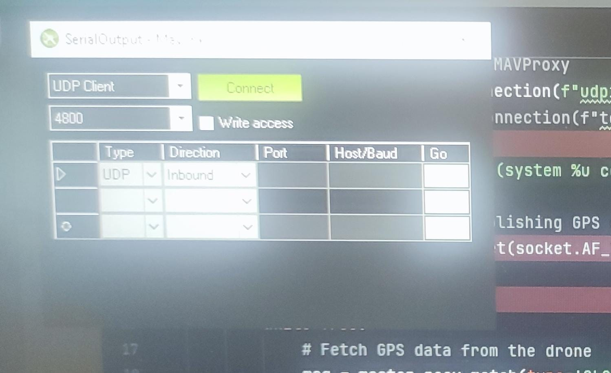

# mavlink_snippets


### Install dependencies
```bash
python -m pip install -r requirements.txt
```


## Dev setup
Install pre-commit hooks:
```bash
pre-commit install

example for output:
(mapConnect) mh@mh:~/PycharmProjects/mapconnect$ pre-commit install
pre-commit installed at .git/hooks/pre-commit

```

## setup udp forwarding on mission planner 
```
    1.create mission simulator on mission planner with selected drone
    2.connect and then :
        1. enter setup 
        2. select advanced
        3. select mavlink miror
        4. UDP CLIENT 48000
        5. UDP inbound port 14550

```




